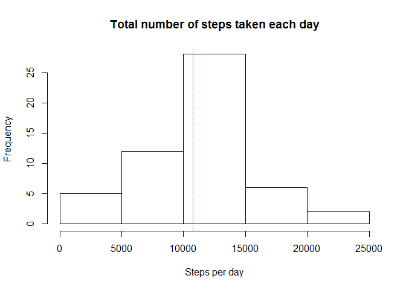
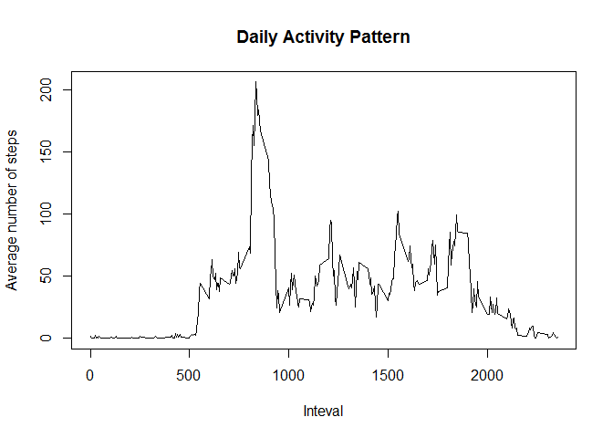
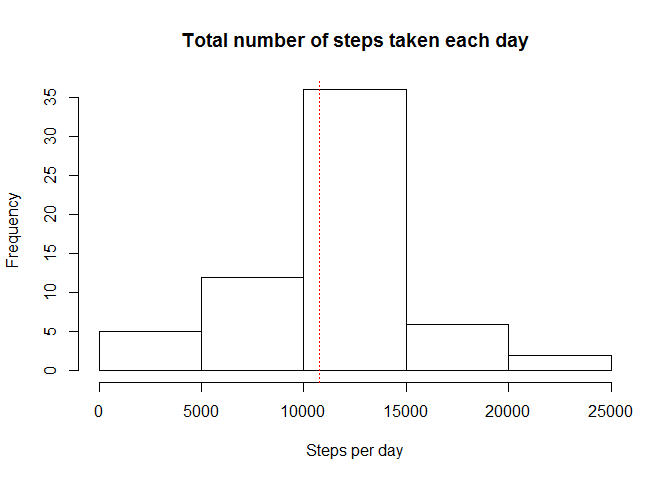
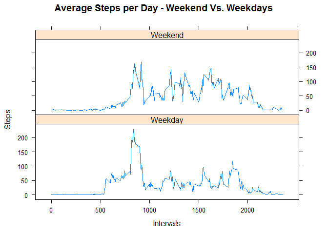

# Reproducible Research: Peer Assessment 1

## Loading and preprocessing the data

```r
unzip("activity.zip")
activityData.DF <- read.csv("activity.csv")
```


## What is mean total number of steps taken per day?

```r
stepsDay <- aggregate(steps ~ date, data = activityData.DF, sum, na.rm = TRUE)
hist( stepsDay$steps
     ,main="Total number of steps taken each day"
     ,xlab="Steps per day")
abline(v=mean(stepsDay$steps),col="red",lty=3)
```

 

```r
meanSteps <- mean(stepsDay$steps) 
medianSteps <- median(stepsDay$steps)
```
The mean of the total number of steps taken per day is: **10,766.19**  
The median of the total number of steps taken per day is: **10,765**  


## What is the average daily activity pattern?

```r
stepsInterval <- aggregate(steps ~ interval, data = activityData.DF, mean, na.rm = TRUE)
plot( steps ~ interval
     ,data = stepsInterval
     ,type = "l"
     ,main="Daily Activity Pattern"
     ,ylab="Average number of steps"
     ,xlab="Inteval")
```

 

```r
maxAvgStepsInterval <- stepsInterval[which.max(stepsInterval$steps), ]$interval
maxAvgSteps <- as.integer(stepsInterval[which.max(stepsInterval$steps), ]$steps)
```
The 5-minute interval, on average across all the days in the dataset, that contains the maximum number of steps is **835** with the maximum average steps being **206** for such interval.

## Imputing missing values
For the following analysis will impute data for missing values as this could introduce bias into the original analysis. In this case our impute **strategy** will use the mean of the steps for each interval in the data set to fill in the missing values in the steps variable.


```r
totalMissingValues <- sum(is.na(activityData.DF))
```
Total missing values in the steps variable: **2,304**  


```r
#Copy of the original data set where we will fill in the missing values
activityData_Imputed.DF <- activityData.DF

#Identify the rows that have missing values (returns an index vector)
na.Observations <- which(is.na(activityData_Imputed.DF$steps))

#Change the row names
stepsInterval2 <- stepsInterval
row.names(stepsInterval2) <- stepsInterval2$interval

#Impute the average steps into the missing variable values
activityData_Imputed.DF[na.Observations,1] <- stepsInterval2[as.character(activityData_Imputed.DF[na.Observations,3]),2]

stepsInterval_Imputed <- aggregate(steps ~ interval
                                   ,data = activityData_Imputed.DF
                                   ,mean
                                   ,na.rm = TRUE)

stepsDay_Imputed <- aggregate(steps ~ date, data = activityData_Imputed.DF, sum, na.rm = TRUE)
hist( stepsDay_Imputed$steps
     ,main="Total number of steps taken each day"
     ,xlab="Steps per day")
abline(v=mean(stepsDay_Imputed$steps),col="red",lty=3)
```

 

```r
meanSteps_Imputed <- mean(stepsDay_Imputed$steps)
medianSteps_Imputed <- median(stepsDay_Imputed$steps)
```
Let's compare the mean and median of steps from the original data set against the one with imputed values. The following table shows the results from each analysis.

| |Original Data Set|Imputed Data Set|  
|:---|:---:|:---:|  
|**Mean**|10,766.19|10,766.19|  
|**Median**|10,765|10,766.19|  

**Based on our impute strategy there was no significant change in the outcome.**

## Are there differences in activity patterns between weekdays and weekends?  


```r
weekenddays <- c("Saturday", "Sunday")
activityData_Imputed.DF$dclass = as.factor(ifelse(is.element(weekdays(as.Date(activityData_Imputed.DF$date)),weekenddays), "Weekend", "Weekday"))

stepsbyDClass <- aggregate(steps ~ interval + dclass, activityData_Imputed.DF, mean)
```
The following graph shows that, on average, the subject is more active than during the weekend compared to the weekdays.


```r
library(lattice)

xyplot(stepsbyDClass$steps ~ stepsbyDClass$interval|stepsbyDClass$dclass
       ,main="Average Steps per Day - Weekend Vs. Weekdays"
       ,xlab="Intervals"
       ,ylab="Steps"
       ,layout=c(1,2), type="l")
```

 
